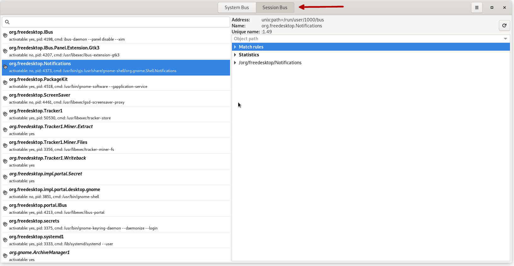
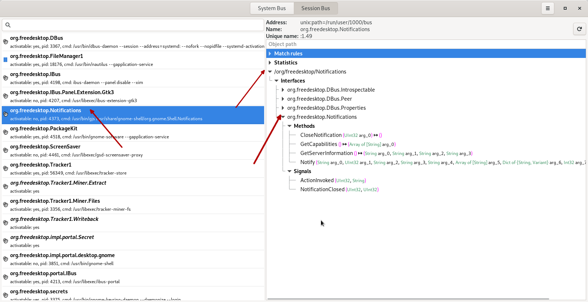
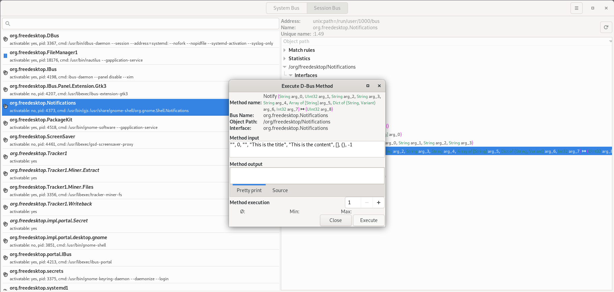
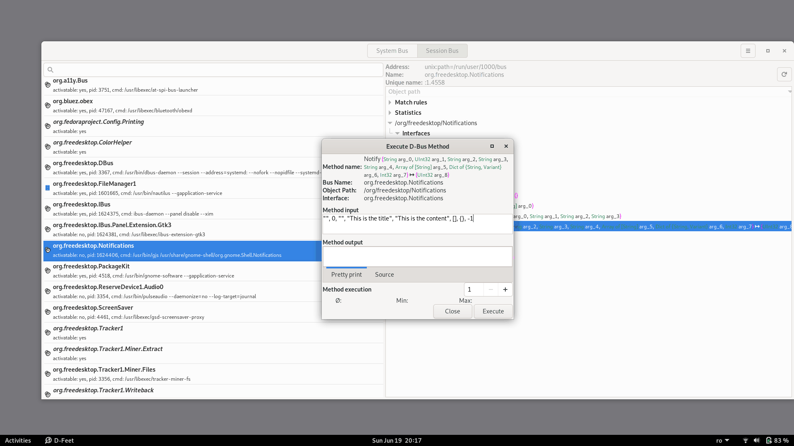
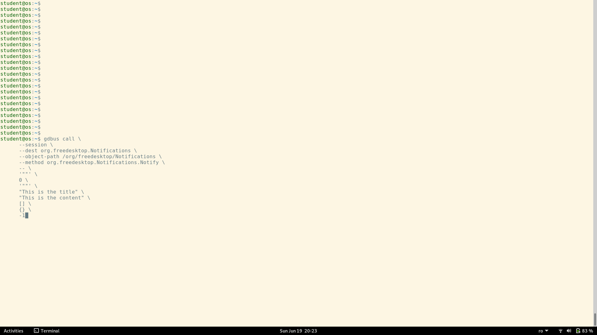
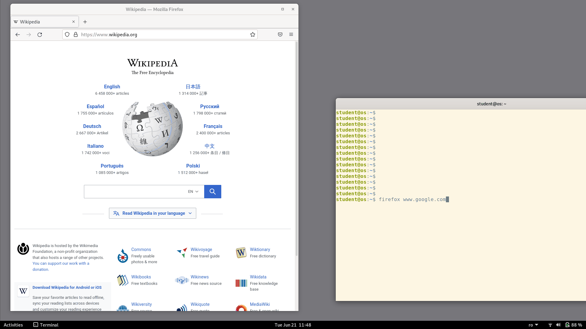
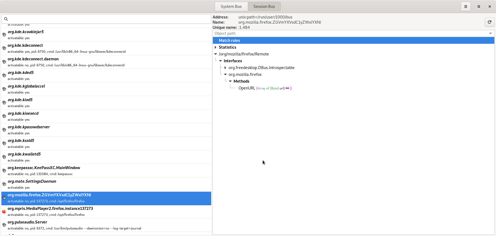
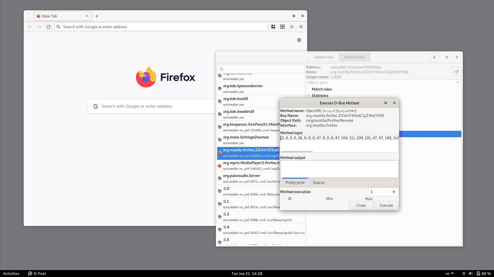

## D-Bus

D-Bus is an Inter-Process Communication (IPC) mechanism that is commonly present on Linux.
It is particularly used by various components of the desktop environment (like GNOME) to communicate between one another, although the system itself is general-purpose and can be used in any other situations.

As the name suggests, the communication model is that of a bus: processes connect to the bus, then exchange messages with other processes through the bus.
The bus itself is implemented by the dbus-daemon, and there are in fact multiple buses: one system bus, accessible system-wide, and one or more session buses, each one corresponding to one user login session.

Every process that connects to D-Bus receives a unique connection name.
This name can be something human-readable, like `org.freedesktop.Notifications`, or some generated ID, like `:1.63`.
Once a process is connected, it can expose one or multiple `objects`.
An object has a path-like name, consisting of strings separated by a slash character (for example `/org/freedesktop/Notifications`).
Each object contains one or more `interfaces`, which have the methods that can be called on that object.

### D-Bus inspection with d-feet

In order to better understand these concepts, we'll use a graphical tool (`d-feet`) to inspect all the available D-Bus objects on our system.

Run d-feet and select `Session Bus` from the top button:



On the left panel we can see all the processes connected to D-Bus with their associated `connection names`.
Scroll down and find `org.freedesktop.Notifications`.
On the right side expand `/org/freedesktop/Notifications` and then expand the `org.freedesktop.Notifications` interface.
The window should look like this:



Some observations:

* The bus communication happens over a Unix socket, with the path `/run/user/1000/bus`.

* `org.freedesktop.Notifications` on the left panel is the `connection name`.

* The process that has connected with this name is `/usr/bin/gjs /usr/share/gnome-shell/org.gnome.Shell.Notifications` and has the pid of `4373`.

* This process exposes one object: `/org/freedesktop/Notifications`.
Note that the object name is the same as the connection name, where the dots have been replaced with slashes.
This is not a requirement, as the objects exposed by a process can have any name.

<!-- markdownlint-disable MD101 -->
* The object has 4 interfaces: `org.freedesktop.DBus.Introspectable`, `org.freedesktop.DBus.Peer`, `org.freedesktop.DBus.Properties` and `org.freedesktop.Notifications`.
Note that the last one (`org.freedesktop.Notifications`) is the same as the connection name, but this again is just a coincidence, not a requirement.
<!-- markdownlint-enable MD101 -->

* The interface `org.freedesktop.Notifications` has some methods that can be called, such as `Notify`.

### Calling D-Bus methods

The application behind `org.freedesktop.Notifications` is responsible with desktop notifications (the small bubbles of text that appear at the top of the screen when some event happens).
When an application wants to send a notification it needs to connect to D-Bus and call the `Notify` method from the `org.freedesktop.Notifications` interface.

In this example we want to call the `Notify` method ourselves.
To do this, we must first understand the signature of this method:

`Notify (String arg_0, UInt32 arg_1, String arg_2, String arg_3, String arg_4, Array of [String] arg_5, Dict of {String, Variant} arg_6, Int32 arg_7) ↦ (UInt32 arg_8)`

This doesn't tell us much, but we can find more documentation [here](https://specifications.freedesktop.org/notification-spec/notification-spec-latest.html#basic-design), since `freedesktop` is an open standard.

We'll set the arguments to the following (for our simple case most of them will be unused):

* `app_name`: `""`

* `replaces_id`: `0`

* `app_icon`: `""`

* `summary`: `"This is the title"`

* `body`: `"This is the content"`

* `actions`: `[]`

* `hints`: `{}`

* `expire_timeout`: `-1`

Now the question is how to actually call the method.
Normally we would have to write an application that connects to D-Bus and executes the call.
But for demonstrative purposes there are easier ways.

One way is directly from d-feet.
If we double-click on the `Notify` method in the right-side pane of d-feet, a window will open that allows us to call the method with any arguments that we want:



Then we click the `Execute` button and the notification will appear:



Another way is from the command-line. There's the `gdbus` tool that can do this:

```console
student@os:~$ gdbus call \
      --session \
      --dest org.freedesktop.Notifications \
      --object-path /org/freedesktop/Notifications \
      --method org.freedesktop.Notifications.Notify \
      -- \
      '""' \
      0 \
      '""' \
      "This is the title" \
      "This is the content" \
      [] \
      {} \
      -1
```

Let's see how it works:



You can also find this `gdbus` call in the `support/dbus/send_notification.sh` script.

### Inspecting the low-level communication

Let's run `gdbus` under `strace` to see what's happening behind the scenes.
Run the script in `support/dbus/send_notification_strace.sh`:

```console
strace: Process 61888 attached
[pid 61887] socket(AF_UNIX, SOCK_STREAM|SOCK_CLOEXEC, 0) = 5
[pid 61887] connect(5, {sa_family=AF_UNIX, sun_path="/run/user/1000/bus"}, 110) = 0
[pid 61887] sendmsg(5, {msg_name=NULL, msg_namelen=0, msg_iov=[{iov_base="\0", iov_len=1}], msg_iovlen=1,
msg_control=[{cmsg_len=28, cmsg_level=SOL_SOCKET, cmsg_type=SCM_CREDENTIALS, cmsg_data={pid=61887,
uid=1000, gid=1000}}],
msg_controllen=32, msg_flags=0}, MSG_NOSIGNAL) = 1
strace: Process 61889 attached

[...]

[pid 61889] sendmsg(5, {msg_name=NULL, msg_namelen=0, msg_iov=[{iov_base="l\1\0\1T\0\0\0\3\0\0\0\237\0\0\0\1
\1o\0\36\0\0\0/org/freedesktop/Notifications\0\0\2\1s\0\35\0\0\0org.freedesktop.Notifications\0\0\0\6\1s\0\35
\0\0\0org.freedesktop.Notifications\0\0\0\10\1g\0\rsusssasa{sv}i\0\0\0\0\0\0\3\1s\0\6\0\0\0Notify\0\0\0\0\0\0
\0\0\0\0\0\0\0\0\0\0\0\0\0\0\0\0\21\0\0\0This is the title\0\0\0\23\0\0\0This is the content\0\0\0\0\0\0\0\0\0
\0\0\0\0\377\377\377\377", iov_len=260}], msg_iovlen=1, msg_controllen=0,
 msg_flags=0}, MSG_NOSIGNAL) = 260
[pid 61889] recvmsg(5, {msg_name=NULL, msg_namelen=0, msg_iov=[{iov_base="l\2\1\1\4\0\0\0\312\0\0\0.\0\0\0", iov_len=16}],
msg_iovlen=1, msg_controllen=0, msg_flags=MSG_CMSG_CLOEXEC}, MSG_CMSG_CLOEXEC) = 16
[pid 61889] recvmsg(5, {msg_name=NULL, msg_namelen=0, msg_iov=[{iov_base="\6\1s\0\6\0\0\0:1.497\0\0\10\1g\0\1u\0\0\5\1u\0
\3\0\0\0\7\1s\0\5\0\0\0:1.49\0\0\0\36\0\0\0", iov_len=52}], msg_iovlen=1, msg_controllen=0, msg_flags=MSG_CMSG_CLOEXEC}, MSG_CMSG_CLOEXEC) = 52
(uint32 30,)
[pid 61889] +++ exited with 0 +++
[pid 61888] +++ exited with 0 +++
+++ exited with 0 +++
```

We see a Unix socket being created and a connection made to `/run/user/1000/bus`, as expected.
Then a series of messages are exchanged on the socket, which are part of the D-Bus protocol.
On a closer look, we can even identify some strings from our notification, like `This is the title` or `This is the content`:

```console
[pid 61889] sendmsg(5, {msg_name=NULL, msg_namelen=0, msg_iov=[{iov_base="l\1\0\1T\0\0\0\3\0\0\0\237\0\0\0\1
\1o\0\36\0\0\0/org/freedesktop/Notifications\0\0\2\1s\0\35\0\0\0org.freedesktop.Notifications\0\0\0\6\1s\0\35
\0\0\0org.freedesktop.Notifications\0\0\0\10\1g\0\rsusssasa{sv}i\0\0\0\0\0\0\3\1s\0\6\0\0\0Notify\0\0\0\0\0\0
\0\0\0\0\0\0\0\0\0\0\0\0\0\0\0\0\21\0\0\0This is the title\0\0\0\23\0\0\0This is the content\0\0\0\0\0\0\0\0\0
\0\0\0\0\377\377\377\377", iov_len=260}], msg_iovlen=1, msg_controllen=0,
```

#### Practice

Use D-Bus to find out the computer's battery level.
There is the `org.freedesktop.UPower` interface on the system bus that can provide this information.
<!-- markdownlint-disable MD101 -->
The method you need to call is `org.freedesktop.DBus.Properties.Get` from the `/org/freedesktop/UPower/devices/DisplayDevice` object.
<!-- markdownlint-enable MD101 -->

This method needs 2 arguments: an interface name and a property name.
<!-- markdownlint-disable MD101 -->
Those should be `org.freedesktop.UPower.Device` and `Percentage` respectively.
<!-- markdownlint-enable MD101 -->

Then input all of the above into a `gdbus` call, which, if everything is correct, should output the battery percentage level as a number between 0 and 100.

Note: if you are running on a desktop computer or inside a virtual machine, you will get the value `0.0`, because those systems don't have a battery.

This task can also be solved in a python script.
Check out the details in the [arena section](./arena.md#d-bus).

### Firefox

Let's do the following experiment:

- Open the Firefox browser

- From a terminal run `firefox www.google.com`



Notice that the URL we passed in the command-line was opened in the existing Firefox window as a new tab.
Even though we started a separate Firefox process, which should have created a separate new window, this didn't actually happen.
Instead, the process that we started from the command-line exited immediately and the site was opened in the already running Firefox instance.

Without any precise knowledge about Firefox internals, we can guess that something like this happened:

- The newly started Firefox process detected that another instance of Firefox is already running

- The newly started Firefox process sent a message to the existing running process, requesting it to open a URL in a new tab

Since we're talking about message passing between 2 processes, there's a chance that maybe D-Bus was involved.
Let's check: we'll use a tool called `dbus-monitor` that will print all messsages passed through D-Bus.

```console
student@os:~$ dbus-monitor
```

Then, in another terminal, we'll run `firefox www.google.com` again.

Going back to the `dbus-monitor` output we find the following:

```console
...
method call time=1655809062.813923 sender=:1.757 -> destination=org.mozilla.firefox.ZGVmYXVsdC1yZWxlYXNl serial=2 path=/org/mozilla/firefox/Remote; interface=org.mozilla.firefox; member=OpenURL
   array of bytes [
      02 00 00 00 1a 00 00 00 2f 00 00 00 2f 68 6f 6d 65 2f 61 64 72 69 61 6e
      73 00 2f 6f 70 74 2f 66 69 72 65 66 6f 78 2f 66 69 72 65 66 6f 78 00 77
      77 77 2e 67 6f 6f 67 6c 65 2e 63 6f 6d 00
   ]
```

There was a D-Bus call to `org.mozilla.firefox.ZGVmYXVsdC1yZWxlYXNl`, on the object `/org/mozilla/firefox/Remote`, method `OpenURL` from the `org.mozilla.firefox` interface.
Indeed, we see that this object exists in d-feet as well:



We can try to call the `OpenURL` method ourselves, directly from d-feet.
The method has only one argument of the type `Array of [Byte]`.
Although there's no documentation for it, we can use the same byte array that we saw in `dbus-monitor`:

```console
   array of bytes [
      02 00 00 00 1a 00 00 00 2f 00 00 00 2f 68 6f 6d 65 2f 61 64 72 69 61 6e
      73 00 2f 6f 70 74 2f 66 69 72 65 66 6f 78 2f 66 69 72 65 66 6f 78 00 77
      77 77 2e 67 6f 6f 67 6c 65 2e 63 6f 6d 00
   ]
```

(Note that `77 77 77 2e 67 6f 6f 67 6c 65 2e 63 6f 6d` at the end is the string `www.google.com`, so that's another confirmation that we're on the right track).


